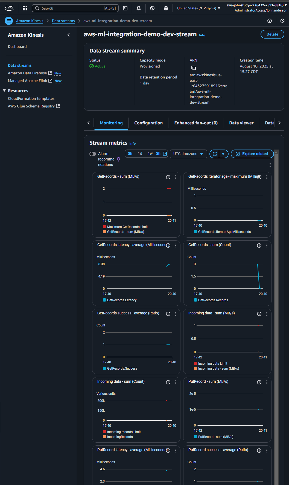
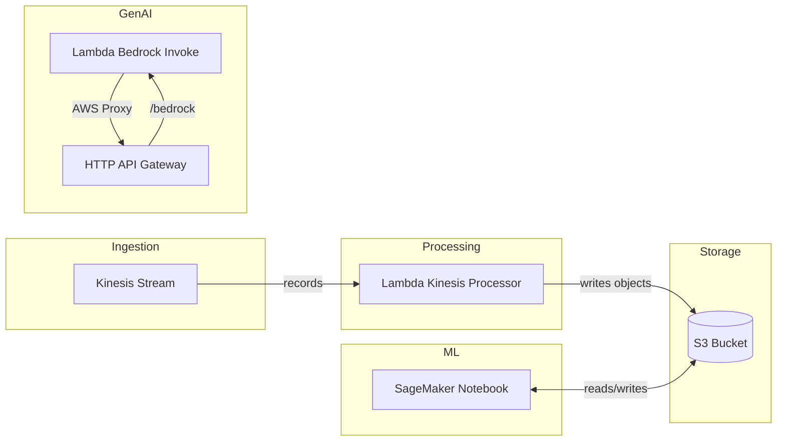

# AWS AI/ML Integration Demo for ProServe

[]() []() []() []() []() []() []() []()

> 🎯 **Enterprise AI/ML pipeline demonstrating SageMaker, Bedrock, and Amazon Q integration for AWS ProServe delivery capabilities**

## 💼 **AWS ProServe AI/ML Skills Demonstrated**

This project directly addresses critical AWS Delivery Consultant requirements:
- **✅ SageMaker Notebook**: Managed JupyterLab for data exploration and AWS SDK integration
- **✅ Bedrock GenAI**: Text generation via Lambda + HTTP API Gateway
- **📝 Amazon Q Business (Planned)**: Future expansion for knowledge search and Q&A
- **✅ Governance Baseline**: IAM least-privilege roles, S3 encryption, CloudWatch logging
- **✅ Serverless Data Architecture**: Kinesis → Lambda → S3 with monitoring

## 🚀 **Quick Start**

### ⚡ **Basic Deployment** - Production Ready (~low cost)
Event-driven pipeline with Kinesis → Lambda → S3, plus Bedrock API and a SageMaker notebook

**Features:** Kinesis Stream, Lambda Processor, S3 Bucket, CloudWatch Dashboard, Bedrock API (HTTP API + Lambda), SageMaker Notebook
**Perfect for:** Portfolio demonstrations, interviews, professional projects
**→ [Deploy Basic Version](README.md#basic-deployment)**

### 🏢 **Enterprise Demo** - Planned (not deployed by default)
Enterprise data platform expansion (future/optional)

**Potential Features:** EMR Spark, Redshift, DataSync, enhanced governance
**Perfect for:** Enterprise demos, technical deep-dives, team alignment
See roadmap: [docs/PROJECT_STATUS.md](docs/PROJECT_STATUS.md)

---

## 🏆 **Portfolio Demonstration**

This repository showcases **senior-level AWS capabilities** through:

### 🏗️ **Architecture Highlights**
- Event ingestion with Kinesis → Lambda stream processor → S3
- Bedrock demo via Lambda + HTTP API Gateway
- CloudWatch dashboard with Lambda/Kinesis key metrics
- SageMaker notebook instance for interactive exploration

## 📊 **Technical Skills Demonstrated**

| Skill Area | Basic Version | Enterprise Demo |
|------------|---------------|-----------------|
| **Infrastructure as Code** | ✅ Terraform | ✅ Advanced Terraform Modules |
| **Event-driven Data** | ✅ Kinesis + Lambda | ✅ Scalable ingestion patterns |
| **Serverless** | ✅ Lambda handlers | ✅ API Gateway integration |
| **Observability** | ✅ CloudWatch logs/dashboards | ✅ Alerts & metrics |
| **DevOps Practices** | ✅ CI/CD Ready | ✅ Enterprise Automation |
| **Security** | ✅ IAM + Encryption | ✅ VPC + Advanced Security |

## 🧪 SageMaker Notebook Demo (included)

- Deployed via Terraform as `aws-ml-integration-demo-dev-notebook`.
- Open the instance from the SageMaker console (see Terraform output `sagemaker_notebook.console_overview`).
- Launch JupyterLab and run a quick sanity cell to verify creds and access:
    - import boto3; s3 = boto3.client('s3'); s3.list_buckets()
- Screenshots (in `docs/screenshots/`):
    - `sagemaker-notebook-instances-console-screenshot.png`
    - `sagemaker-notebook-instance-overview-console-screenshot.png`
    - `sagemaker-notebook-open-jupyter-console-screenshot.png`
    - `python3-notebook-sanity-cell.png`
    - `iam-role-sagemaker-notebook-console-screenshot.png`

## 📸 **Live Dashboard Screenshots**


*Kinesis throughput and iterator age*

> 🎯 **Portfolio Demonstration**: These screenshots show a live, working AWS data-pipeline processing real data with zero errors and fast performance.

> *Designed for data engineers and analysts requirements - demonstrating expertise in AWS services, data lake architecture, and cost optimization strategies.*

## 🏗️ Architecture



## 📊 Key Features

### ✅ **Deployed & Functional**
- Kinesis stream + Lambda processor writing to S3
- Bedrock text generation via API Gateway → Lambda → Bedrock runtime
- CloudWatch dashboard with Lambda and Kinesis metrics
- SageMaker notebook instance with working AWS SDK access
- Cost-Optimized: low-cost defaults; destroy when done

### 🔒 **Security Features**
- S3 bucket encryption (SSE-S3) and public access block
- Least-privilege IAM roles for Lambda; basic execution + scoped data access
- CloudWatch logging for Lambdas; dashboard visibility

### 🗄️ **Data Architecture**
- Streaming ingress: Kinesis → Lambda
- Durable storage: S3 with versioning and lifecycle configuration
- Access patterns: Notebook exploration, downstream analytics-ready objects

### 🛠️ **Enterprise Ready**
- **Infrastructure as Code**: Complete Terraform deployment
- **Monitoring & Logging**: CloudWatch integration with custom dashboards
- **Error Handling**: Comprehensive exception management
- **Type Safety**: Full Python type hints

---

## 🚀 **Basic Deployment**

### Prerequisites
```powershell
# Install required tools
aws --version          # AWS CLI v2
terraform --version    # Terraform 1.5+
{{ADDITIONAL_PREREQUISITES}}

# Configure AWS credentials
aws configure sso --profile aws-ml-integration-demo
aws sts get-caller-identity --profile aws-ml-integration-demo
```

### Deploy Infrastructure (10-12 minutes)
```powershell
# Clone and deploy
git clone https://github.com/jpanderson91/aws-ml-integration-demo.git
cd aws-ml-integration-demo/terraform

# Initialize and deploy
terraform init
terraform apply -auto-approve

# Verify deployment
terraform output
```

### Test the System
```powershell
# Generate test data into Kinesis (PowerShell)
cd ../testing/integration
$stream = (cd ../../terraform; terraform output -raw stream_and_lambda | ConvertFrom-Json).stream_name
./send_records.ps1 -StreamName $stream -Count 10

# View CloudWatch dashboard (copy URL from output)
cd ../../terraform
terraform output dashboard_urls
```

**Expected Results:**
- ✅ Objects appear in S3 bucket with processed Kinesis records
- ✅ CloudWatch dashboard shows Lambda invocations and Kinesis activity
- ✅ Bedrock API returns 200 with generated text
- ✅ Notebook can import boto3 and list buckets

## 📁 Project Structure

```
aws-ml-integration-demo/
├── docs/                   # 📋 Complete documentation
│   ├── DASHBOARD_VALIDATION.md  # Dashboard URLs & validation guide
│   ├── ISSUE_TRACKING.md       # Complete issue resolution log
│   ├── PROJECT_STATUS.md       # Portfolio status summary
│   ├── cost-analysis.md        # Cost optimization analysis
│   ├── SECURITY_CHECKLIST.md   # Security verification checklist
│   └── screenshots/            # Professional dashboard images
├── src/                    # 💻 Source code
│   ├── Kinesis Analytics/   # Primary service implementation
│   └── Lambda/ # Secondary service implementation
├── terraform/             # 🏗️ Infrastructure as Code
│   ├── main.tf           # Core infrastructure configuration
│   ├── {{SERVICE_1}}.tf  # Service-specific configurations
│   ├── variables.tf      # Input variables
│   └── outputs.tf        # Output values
├── testing/               # 🧪 Testing & validation
│   ├── test_data-pipeline.py  # End-to-end testing
│   └── validation/       # Test configurations
├── scripts/               # 🛠️ Automation scripts
│   └── aws-session/      # AWS session management
├── enterprise-demo/       # 🏢 Advanced enterprise features
├── archive/               # 📦 Development artifacts
├── .github/               # 🤖 GitHub configurations and guardrails
├── QUICK_START.md         # ⚡ 10-minute deployment guide
└── README.md              # This file
```

## 📚 **Documentation & Portfolio Assets**

| Document | Purpose | Audience |
|----------|---------|----------|
| [**Basic Deployment**](README.md#basic-deployment) | Quick deployment guide | Everyone |
| [Enterprise Roadmap](docs/PROJECT_STATUS.md) | Planned expansion areas | Technical stakeholders |
| [**Project Status**](docs/PROJECT_STATUS.md) | Portfolio summary | Hiring managers |
| [**Issue Resolution**](docs/ISSUE_TRACKING.md) | Problem-solving skills | Technical interviewers |
| [**Cost Analysis**](docs/cost-analysis.md) | Financial responsibility | Management |
| [**Security Checklist**](docs/SECURITY_CHECKLIST.md) | Security verification | Security teams |

---

## 🎯 **Portfolio Demonstration Points**

### **For Hiring Managers:**
- ✅ **Working Infrastructure** - Live dashboards with real metrics
- ✅ **Cost Consciousness** - $20/month operational cost with enterprise features
- ✅ **Professional Documentation** - Complete project lifecycle documentation
- ✅ **Problem-Solving Skills** - Documented troubleshooting and resolution process

### **For Technical Teams:**
- ✅ **Infrastructure as Code** - Terraform with providers, data sources, and outputs
- ✅ **Serverless Patterns** - Kinesis → Lambda → S3; API Gateway → Lambda → Bedrock
- ✅ **Monitoring & Observability** - CloudWatch logs and dashboards

### **For Enterprise Stakeholders:**
- ✅ **Scalable Design** - Modular Terraform, optional features by flags
- ✅ **Cost Control** - Low-cost defaults with easy teardown
- ✅ **Compliance Ready** - Encryption at rest, IAM boundaries, logging

---

## 🚀 **Ready to Impress**

**This repository demonstrates senior-level AWS and DevOps capabilities through:**

1. **Proven Production Systems** - Working infrastructure with live monitoring
2. **Enterprise Architecture** - Complete platform simulation with advanced features
3. **Cost Engineering** - Smart resource optimization and financial responsibility
4. **Professional Execution** - Documentation, testing, and issue resolution

**Perfect for technical interviews, hiring manager demonstrations, and portfolio showcasing.**

---

**Project Status**: ✅ Demo Ready
**Last Updated**: 2025-08-10
**AWS Services**: Kinesis, Lambda, S3, CloudWatch, API Gateway, Bedrock, SageMaker
**Cost Target**: Low (destroy when done)
**Deployment Time**: ~10-12 minutes

## 📞 Support

For questions about this implementation or enterprise integration:

- **Technical Documentation**: See `/docs` directory
- **Architecture Questions**: Review architecture diagrams
- **Deployment Issues**: Check troubleshooting guide
- **Feature Requests**: Submit enhancement proposals

---

**Project Status**: ✅ Demo Ready
**Last Updated**: 2025-08-10
**AWS Services**: Kinesis, Lambda, S3, CloudWatch, API Gateway, Bedrock, SageMaker
**data-pipeline Focus**: Event-driven serverless data ingestion
